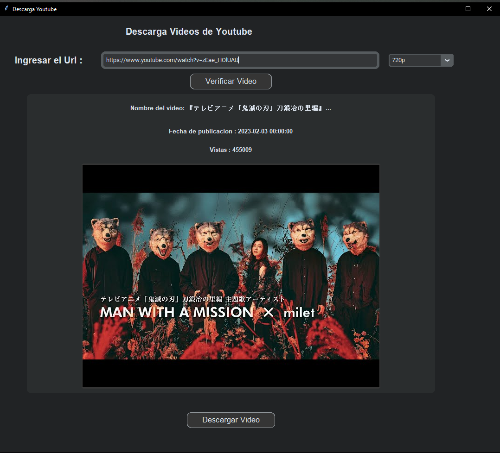

# Youtube Descarga
He creado un script para descargar videos de youtube 
en varias resoluciones usando paquetes Open Source.



#### Para bajar video a mas de 1080. https://ffmpeg.org/ para dividir el video y el audio y con el programa podras unir las dos partes.

Si tienes pipenv lo puedes usar o tambien instalar desde el archivo requirements

```python
    pip install pipenv
```

```python
    pipenv shell
```

```python
    pipenv install
```